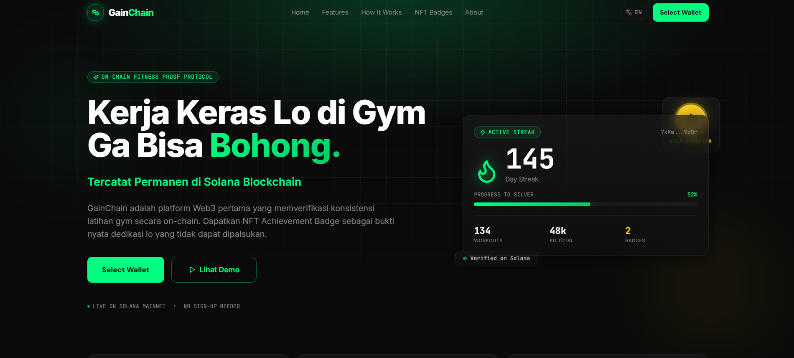
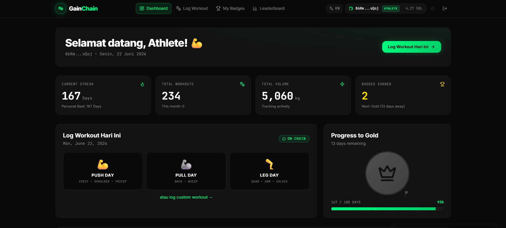
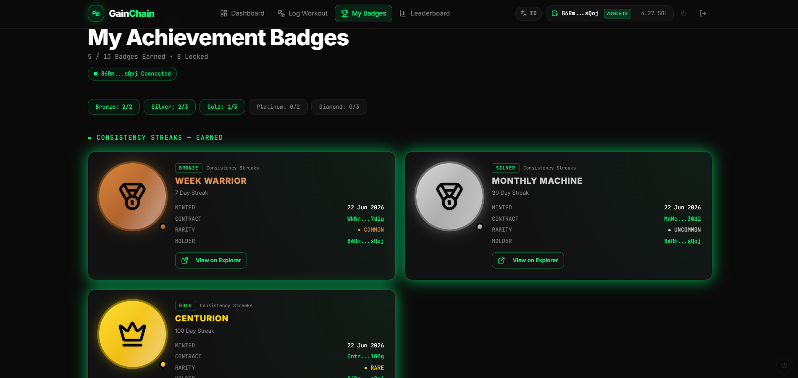
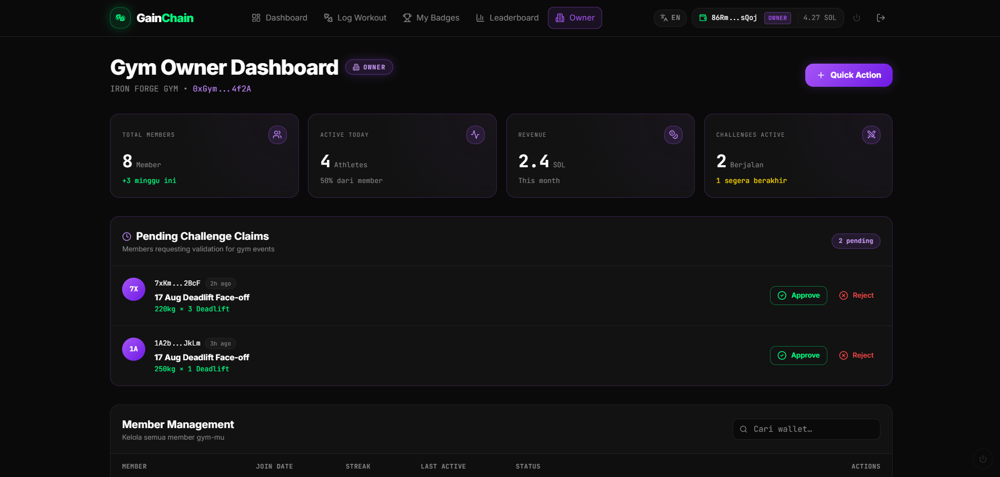
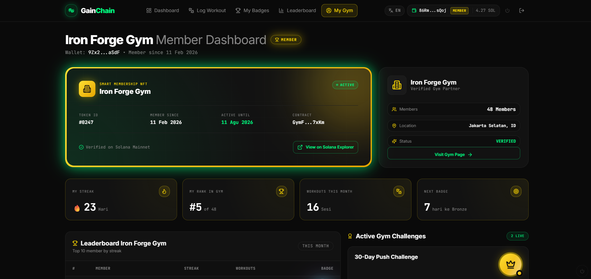
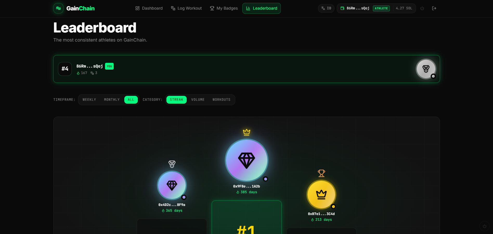

<div align="center">


# ⛓️ GainChain

### On-Chain Fitness Proof Protocol on Solana

**Bukti kerja keras lo di gym, tersimpan selamanya di blockchain.**

[](https://chain-fit-proof.vercel.app)
[](https://solana.com)
[](https://react.dev)
[](LICENSE)

</div>

---

## 📌 Tentang Proyek

**GainChain** adalah Decentralized Application (DApp) pertama di Indonesia yang menggabungkan **pencatatan aktivitas kebugaran** dengan teknologi **Solana Blockchain** dan sistem **gamifikasi NFT**.

Proyek ini lahir dari satu masalah nyata:

> *"Gym-goer bisa ngaku rajin latihan, tapi siapa yang bisa buktiin?"*

GainChain menjawab pertanyaan itu dengan menyimpan setiap sesi latihan secara **permanen, transparan, dan tidak dapat dimanipulasi** di atas Solana blockchain — dan memberikan **NFT Achievement Badge** sebagai bukti pencapaian yang sah.

> 🎓 Dikembangkan sebagai Tugas Akhir Mata Kuliah **Keamanan Data & Blockchain**  
> Universitas Semarang — Semester 5

---

## 🚨 Masalah Yang Diangkat

| Masalah | Dampak |
|---|---|
| Catatan gym mudah dimanipulasi atau dihapus | Tidak ada akuntabilitas nyata |
| Tidak ada sistem verifikasi konsistensi yang objektif | Motivasi jangka panjang rendah |
| Membership gym masih manual dan rentan fraud | Gym owner sulit kelola member |
| Reward konvensional tidak bernilai permanen | User mudah berhenti |

---

## ✨ Fitur Utama

### 🛡️ Sport-Science Anti-Cheat Engine
Sistem keamanan data *frontend* menggunakan **Formula 1RM Brzycki** untuk memvalidasi setiap input beban latihan secara matematis. Jika input terdeteksi sebagai anomali fisiologis, transaksi diblokir sebelum dikirim ke *smart contract* — menjamin integritas dan kebersihan data di blockchain.

### 🏅 NFT Achievement Badge System
Gamifikasi berbasis aset digital **Non-Fungible Token (NFT)** yang di-*mint* otomatis via *smart contract* saat pengguna mencapai milestone tertentu:

| Badge | Target | Rarity |
|---|---|---|
| 🥉 BRONZE ATHLETE | 30 Hari Streak | Common |
| 🥈 SILVER WARRIOR | 90 Hari Streak | Uncommon |
| 🥇 GOLD CHAMPION | 180 Hari Streak | Rare |
| 💎 DIAMOND LEGEND | 365 Hari Streak | Legendary |

### 👥 Arsitektur Multi-Role (3 Dashboard)

```
┌─────────────────────────────────────────────────────┐
│                   GAINCHAIN ECOSYSTEM                │
│                                                      │
│  👤 SOLO ATHLETE    🏢 GYM OWNER    👥 GYM MEMBER   │
│  ─────────────      ───────────      ────────────    │
│  Log workout        Member mgmt      My gym page     │
│  Streak tracker     Smart member NFT  Leaderboard    │
│  NFT Badges         Challenges        My Badges      │
│  Leaderboard        Analytics         Challenges     │
└─────────────────────────────────────────────────────┘
                    Solana Blockchain
```

---

## 🛠️ Tech Stack

| Layer | Teknologi |
|---|---|
| **Frontend** | React 18, TypeScript, Vite |
| **Styling** | Tailwind CSS, shadcn/ui |
| **Blockchain** | Solana Web3.js, Wallet Adapter |
| **Wallet** | Phantom, Solflare |
| **State** | React Context + localStorage |
| **Routing** | React Router v6 |
| **Deployment** | Vercel |

---

## 🚀 Cara Menjalankan Lokal

### Prerequisites
- [Node.js](https://nodejs.org/) v18+ atau [Bun](https://bun.sh/)
- [Git](https://git-scm.com/)
- Browser dengan [Phantom Wallet](https://phantom.app/) extension

### Installation

```bash
# 1. Clone repository
git clone https://github.com/riskybaguse/chain-fit-proof.git
cd chain-fit-proof

# 2. Install dependencies
npm install
# atau pakai bun
bun install

# 3. Jalankan development server
npm run dev
# atau
bun dev
```

Buka browser dan akses `http://localhost:5173`

### Build untuk Production

```bash
npm run build
npm run preview
```

---

## 📱 Demo & Screenshot

| Landing Page | Solo Dashboard | Badges |
|---|---|---|
|  |  |  |

| Owner Dashboard | Member Dashboard | Leaderboard |
|---|---|---|
|  |  |  |

> 🔗 **Live Demo:** [chain-fit-proof.vercel.app](https://chain-fit-proof.vercel.app)

---

## 🗺️ Roadmap

- [x] Frontend MVP — UI/UX semua halaman
- [x] Multi-role system (Solo / Owner / Member)
- [x] Wallet connection (Phantom / Solflare)
- [x] Workout logger dengan localStorage persistence
- [x] NFT Badge system (visual + logic dari streak real)
- [x] Anti-cheat engine (Formula 1RM Brzycki)
- [ ] Smart Contract — Workout Logger (Rust/Anchor)
- [ ] Smart Contract — NFT Badge Minter
- [ ] Smart Contract — Membership NFT Manager
- [ ] Deploy ke Solana Devnet
- [ ] Real NFT minting on-chain
- [ ] Deploy ke Solana Mainnet

---

## 📚 Referensi Akademis

Penelitian ini didukung oleh jurnal-jurnal internasional:

1. **Mahmood et al. (2023)** — *Exercise Adherence: Measurement, Determinants & Barriers* — Journal of Bodywork and Movement Therapies
2. **Ozdamli & Milrich (2023)** — *Positive and Negative Impacts of Gamification on Fitness* — European Journal of Investigation in Health
3. **Kim et al. (2023)** — *Gamification Aspects of Fitness Apps* — International Journal of Human–Computer Interaction
4. **Huang et al. (2024)** — *Motivation Crowding Effects on Gamified Fitness Apps* — Frontiers in Psychology
5. **Ahmed (2025)** — *Enhancing Data Security: The Role of Blockchain* — IJAEMS
6. **Ante & Fiedler (2025)** — *DeFi and NFTs: Transforming Value Creation* — Digital Business (Elsevier)
7. **Maariz et al. (2024)** — *Blockchain: Revolutionizing Data Integrity* — ITEE Journal

---

## 👨‍💻 Developer

<div align="center">

**Risky Bagus**  
Mahasiswa Teknik Informatika — Universitas Semarang  
Mata Kuliah: Keamanan Data & Blockchain — Semester 5

[](https://github.com/riskybaguse)

</div>

---

## 📄 Lisensi

```
MIT License — bebas digunakan untuk keperluan edukatif.
© 2025 GainChain • Built on Solana • Powered by Smart Contract
```

---

<div align="center">

**"Kerja keras lo di gym layak dapat pengakuan yang ga bisa dipalsukan."**

⛓️ **GainChain** — On-Chain Fitness Proof Protocol on Solana

</div>